# KN 全链路架构审查报告

> 审查日期: 2026-06-27
> 覆盖仓库: kn (Desktop/Agent/CLI)、kn-cloud (Java Spring Boot)、kn-ios (Swift)
> 审查范围: 10 条通信链路、25+ 风险点、跨链路影响分析

---

## 目录

1. [系统全景图](#1-系统全景图)
2. [通信链路分析](#2-通信链路分析)
   - [链路 A: 设备绑定](#链路-a-设备绑定)
   - [链路 B: iOS 远程控制](#链路-b-ios-远程控制)
   - [链路 C: 桌面本地终端](#链路-c-桌面本地终端)
   - [链路 D: Agent 会话生命周期](#链路-d-agent-会话生命周期)
   - [链路 E: Shell 包装器 → Agent IPC](#链路-e-shell-包装器--agent-ipc)
   - [链路 F: 用户认证](#链路-f-用户认证)
   - [链路 G: 跨节点消息中继](#链路-g-跨节点消息中继)
   - [链路 H: 配置管理](#链路-h-配置管理)
   - [链路 I: 兑换码流程](#链路-i-兑换码流程)
   - [链路 J: 会话恢复](#链路-j-会话恢复)
3. [跨切面关注点](#3-跨切面关注点)
4. [风险分类汇总](#4-风险分类汇总)
5. [改进建议](#5-改进建议)
6. [附录](#6-附录)

---

## 1. 系统全景图

### 1.1 组件总览

```
┌─────────────────────────────────────────────────────────────────────┐
│                          KN 系统全景                                  │
│                                                                      │
│  ┌─────────────────────── macOS ───────────────────────────┐        │
│  │                                                           │        │
│  │  ┌──────────┐    IPC Unix Socket     ┌───────────────┐   │        │
│  │  │ Desktop  │◄──────────────────────►│  Agent 守护进程 │   │        │
│  │  │ (Tauri)  │   ~/.kn/agent/ipc.sock │  (Rust/launchd)│   │        │
│  │  └────┬─────┘                        └───────┬───────┘   │        │
│  │       │                                      │            │        │
│  │       │ Tauri Cmd                            │ WSS        │        │
│  │       │ (Rust)                               │ device_token│       │
│  │       ▼                                      │            │        │
│  │  ┌──────────┐    flock 锁                   │            │        │
│  │  │config.yaml│◄────────────────────────────┐ │            │        │
│  │  └──────────┘                             │ │            │        │
│  │       ▲                                    │ │            │        │
│  │       │ sed/awk                            │ │            │        │
│  │  ┌────┴─────┐                        ┌─────┴─▼──────┐   │        │
│  │  │Shell ai()│                        │  PTY Sessions │   │        │
│  │  └──────────┘                        │  (最多10个)    │   │        │
│  │                                       └──────────────┘   │        │
│  └───────────────────────────────────────────────────────────┘        │
│                                                                      │
│  ┌────────────────────── Cloud ─────────────────────────────┐        │
│  │                                                           │        │
│  │  ┌──────────────┐           ┌──────────────────┐         │        │
│  │  │  REST API    │           │  WebSocket 服务   │         │        │
│  │  │  :8080       │           │  :8081            │         │        │
│  │  │  AuthFilter  │           │  KnWsHandler      │         │        │
│  │  │  9 Controllers│          │  SessionCoordinator│        │        │
│  │  └──────┬───────┘           └────────┬─────────┘         │        │
│  │         │                            │                    │        │
│  │         ▼                            ▼                    │        │
│  │  ┌──────────┐              ┌──────────────────┐          │        │
│  │  │  MySQL   │              │     Redis 7       │          │        │
│  │  │  8.0     │              │  20+ Key Patterns │          │        │
│  │  └──────────┘              └──────────────────┘          │        │
│  └───────────────────────────────────────────────────────────┘        │
│                                                                      │
│  ┌────────────────────── iOS ───────────────────────────────┐        │
│  │                                                           │        │
│  │  ┌──────────────────┐    ┌─────────────────────────┐     │        │
│  │  │  SwiftUI App     │    │  WKWebView Terminal      │     │        │
│  │  │  MainTabView     │    │  (xterm.js Canvas)       │     │        │
│  │  │  4 Tabs          │    └─────────────────────────┘     │        │
│  │  └────────┬─────────┘                                    │        │
│  │           │                                               │        │
│  │  ┌────────▼─────────┐    ┌─────────────────────────┐     │        │
│  │  │  HTTPClient      │    │  WebSocketTransport      │     │        │
│  │  │  (URLSession)    │    │  (URLSessionWebSocketTask)│    │        │
│  │  └──────────────────┘    └─────────────────────────┘     │        │
│  │                                                           │        │
│  │  ┌──────────────────────────────────────────────────┐    │        │
│  │  │  KeychainTokenStore (access + refresh token)      │    │        │
│  │  └──────────────────────────────────────────────────┘    │        │
│  └───────────────────────────────────────────────────────────┘        │
└─────────────────────────────────────────────────────────────────────┘
```

### 1.2 运行时组件清单

| 序号 | 组件 | 语言/框架 | 运行位置 | 端口/Socket |
|------|------|----------|---------|------------|
| 1 | Desktop 前端 | React/TypeScript | macOS GUI | — |
| 2 | Desktop 后端 | Rust/Tauri v2 | macOS GUI 进程 | — |
| 3 | Agent 守护进程 | Rust/tokio | macOS launchd | IPC: `~/.kn/agent/ipc.sock` |
| 4 | Cloud REST API | Java 21/Spring Boot 3.3 | 服务器 | 8080 |
| 5 | Cloud WebSocket | Java 21/Spring Boot 3.3 | 服务器 | 8081 |
| 6 | iOS App | Swift/SwiftUI | iPhone/iPad | — |
| 7 | Shell 包装器 | Bash | macOS 终端 | — |
| 8 | Python CLI | Python 3 | macOS 终端 | — |

### 1.3 持久化存储

| 存储 | 位置 | 内容 | 访问方式 |
|------|------|------|---------|
| MySQL 8.0 | 服务器 | 用户、设备、会话、兑换码、消息 | MyBatis-Plus |
| Redis 7 | 服务器 | 会话状态、心跳、去重、绑定码、离线队列 | Jedis/Lettuce |
| config.yaml | `~/.kn/config.yaml` | Profile 环境变量配置 | serde_yaml / Python 手写解析器 |
| Keychain | iOS 设备 | JWT access_token + refresh_token | Security Framework |
| 文件系统 | `~/.kn/agent/` | device_token, crash_count, session 日志 | std::fs |

### 1.4 入口点

| 起点 | 用户操作 | 触发链路 |
|------|---------|---------|
| **iOS 用户** | 登录/注册 | F → (A) → B |
| **iOS 用户** | 扫码绑定设备 | A |
| **iOS 用户** | 启动远程终端 | B |
| **Desktop 用户** | 打开 Desktop App | C, D, H |
| **Desktop 用户** | 点击"绑定设备" | A |
| **Desktop 用户** | 输入兑换码 | I |
| **Shell 用户** | 执行 `ai claude myprofile` | E |
| **Agent 进程** | 系统启动/launchd 拉起 | D |
| **Agent 进程** | 崩溃后重启 | J |

---

## 2. 通信链路分析

### 链路 A: 设备绑定

**链路描述**: Desktop 生成 QR 码(含 6 位绑定码) → iOS 扫码确认 → Agent 轮询结果 → 获得 device_token → 建立 WSS 连接的基础凭证。

**参与仓库**: kn (Desktop + Agent)、kn-cloud (REST API)、kn-ios (扫码 + 确认)

#### A.1 时序图

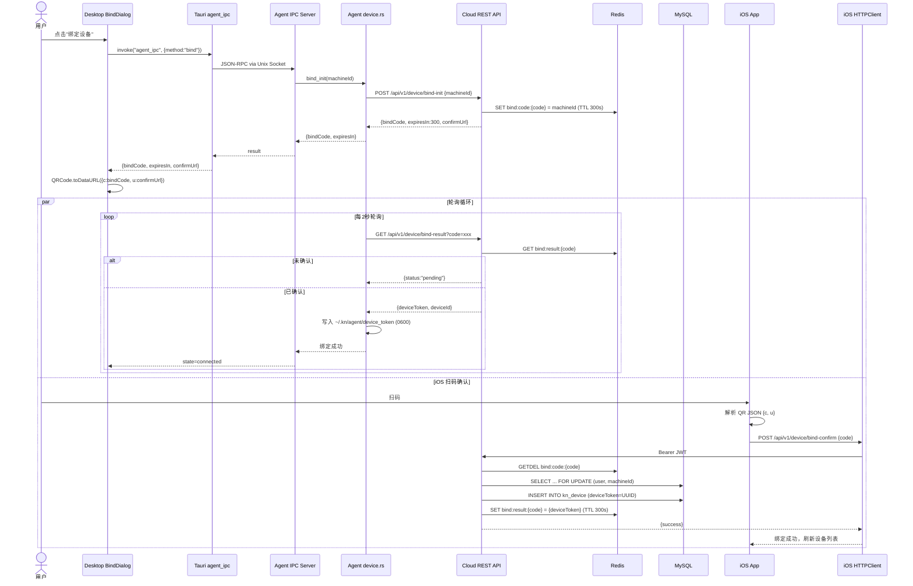

#### A.2 节点清单

| # | 节点 | 位置 | 作用 | 风险等级 | 故障模式 |
|---|------|------|------|---------|---------|
| A1 | Desktop BindDialog UI | `desktop/src/components/BindDialog.tsx` | 显示 QR 码，轮询状态 | 🟡 中 | QR 渲染失败、用户提前关闭对话框 |
| A2 | Tauri agent_ipc 桥接 | `desktop/src-tauri/src/agent_ipc.rs` | 前端 ↔ Agent IPC 转发 | 🟡 中 | IPC socket 不存在(Agent 未运行)，5s 超时 |
| A3 | Agent IPC bind 处理 | `agent/src/ipc.rs` handle_bind | 接收绑定请求，校验状态 | 🔴 高 | 状态机拒绝 Binding 转换，bind_http_url 未配置 |
| A4 | Agent bind_init HTTP | `agent/src/device.rs` bind_init() | 向云端请求绑定码 | 🔴 高 | 网络超时、Cloud API 不可达 |
| A5 | Cloud bind-init 接口 | `kn-cloud-api/.../DeviceController.java` | 生成 6 位绑定码存入 Redis | 🔴 高 | Redis 不可用，无法存储绑定码 |
| A6 | iOS QR 扫描 | `kn-ios/.../QRCodeScannerView.swift` | 摄像头捕获 QR 码 | 🟡 中 | 摄像头权限未授权、QR 解析失败 |
| A7 | iOS bind-confirm | `kn-ios/.../DeviceViewModel.swift` | 提交确认请求 | 🟡 中 | 网络错误、JWT 过期 |
| A8 | Cloud bind-confirm 接口 | `kn-cloud-api/.../DeviceController.java` | 校验码 + 创建设备 + 写入结果 | 🔴 高 | MySQL 写入失败、设备数量超限 |
| A9 | Agent bind_poll 循环 | `agent/src/device.rs` bind_poll() | 每 2s 轮询绑定结果 | 🔴 高 | 超时未获取 token，绑定失败 |
| A10 | Agent token 持久化 | `agent/src/device.rs` save_device_token() | 原子写入 device_token | 🟢 低 | 磁盘满、目录权限问题 |

#### A.3 风险详情

| 风险编号 | 描述 | 可能性 | 影响 | 缓解措施 | 状态 |
|---------|------|--------|------|---------|------|
| A-R1 | **绑定码过期(300s)** — iOS 用户在 5 分钟内未完成扫码确认 | 中 | 需重新发起绑定 | 倒计时 UI 提示，到期后自动重试 | ✅ 已实现 |
| A-R2 | **防重复轮询** — bind_poll 和 cancel_bind 使用 generation 计数，旧轮询任务不会覆盖新绑定状态 | 低 | 状态机卡死 | generation guard 机制 | ✅ 已实现 |
| A-R3 | **设备数量限制** — 试用用户 1 台，Pro 用户 3 台 | 中 | 绑定被拒绝 | 绑定前检查设备数，超限给出明确提示 | ✅ 已实现 |
| A-R4 | **跨用户同机绑定** — 同一台 Mac 被多个用户绑定 | 低 | 安全性问题 | `SELECT ... FOR UPDATE` on machineId + DB UNIQUE 约束 | ✅ 已实现 |
| A-R5 | **Redis 不可用时绑定** — bind:code 和 bind:result 都在 Redis | 低 | 绑定流程阻断 | 无降级方案 | ⚠️ 无 |
| A-R6 | **Agent 未运行时 Desktop 点击绑定** — IPC socket 不存在 | 高 | 用户看到错误提示 | BindDialog 可触发 Agent 启动 | ⚠️ 部分 |

#### A.4 对其他链路的影响

| 受影响链路 | 影响方式 | 严重程度 |
|-----------|---------|---------|
| **链路 B (iOS 远程控制)** | 无 device_token → Agent 无法 WSS 连接 → 远程控制不可用 | 🔴 阻断 |
| **链路 D (Agent 生命周期)** | 绑定是 WSS 连接前提，未绑定则 Agent 停在 Unbound 状态 | 🔴 阻断 |
| **链路 E (Shell IPC)** | 不影响(Shell 走本地 IPC，不依赖云端) | 🟢 无影响 |
| **链路 F (用户认证)** | iOS 必须先登录(JWT)才能调 bind-confirm | 前置依赖 |
| **链路 I (兑换码)** | Desktop 兑换需 device_token → 先完成绑定 | 前置依赖 |

---

### 链路 B: iOS 远程控制

**链路描述**: iOS 用户通过 WebSocket 远程控制 Mac 上的终端会话。包含 6 个子路径：会话启动、输入、输出、终端缩放、控制信号、心跳。

**参与仓库**: kn (Agent)、kn-cloud (WSS)、kn-ios (终端 UI)

#### B.1 会话启动子路径

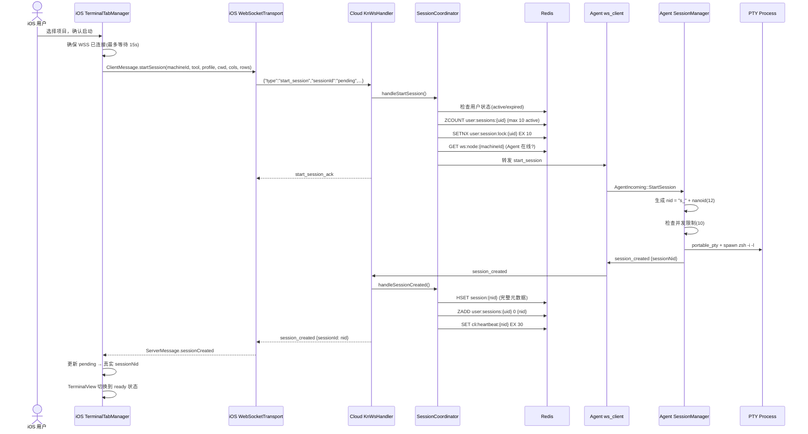

#### B.2 输入子路径 (iOS → Agent)

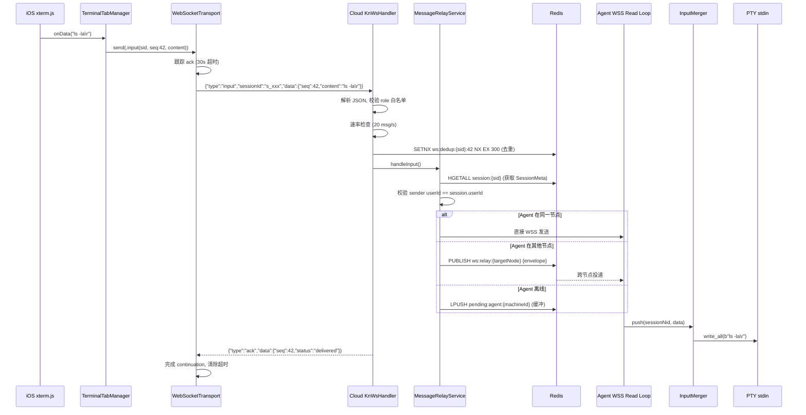

#### B.3 输出子路径 (Agent → iOS)

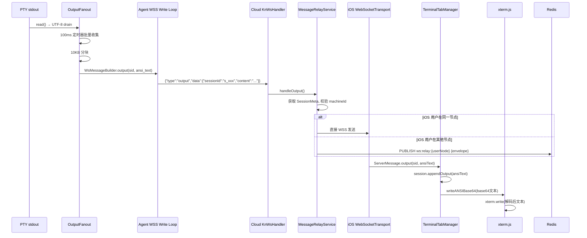

#### B.4 控制信号子路径

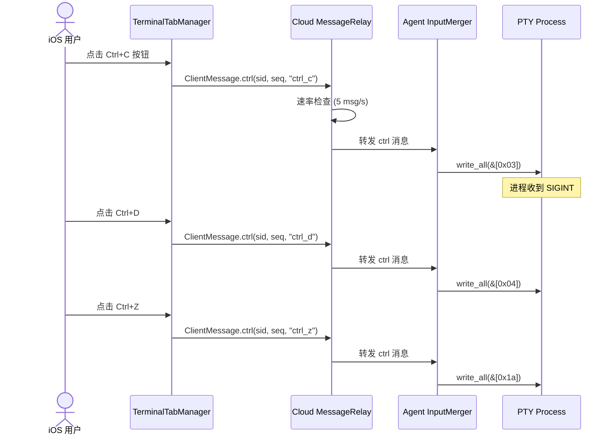

#### B.5 节点清单

**会话启动子路径 (12 个节点)**

| # | 节点 | 位置 | 风险 | 故障模式 |
|---|------|------|------|---------|
| B1 | iOS TerminalTabManager | `kn-ios/.../TerminalTabManager.swift` | 🟡 中 | WSS 连接等待超时(15s)、启动超时 |
| B2 | iOS WebSocketTransport.send | `kn-ios/.../WebSocketTransport.swift` | 🔴 高 | send 失败触发重连、sessionId="pending" 解析异常 |
| B3 | Cloud KnWsHandler parseAndValidate | `kn-cloud-ws/.../KnWsHandler.java` | 🟢 低 | JSON 解析失败(1MB 限制) |
| B4 | Cloud SessionCoordinator | `kn-cloud-ws/.../SessionCoordinator.java` | 🔴 高 | 用户状态检查失败、Agent 离线、会话数超限(10) |
| B5 | Redis SETNX 互斥锁 | Redis | 🟡 中 | Redis 不可用 → 锁获取失败 → 并发创建风险 |
| B6 | Cloud → Agent 转发 | KnWsHandler | 🔴 高 | Agent 离线 → start_session 丢失 |
| B7 | Agent SessionManager.create | `agent/src/session/manager.rs` | 🔴 高 | 并发限制(10)、remote 限制(10)、nid 碰撞 |
| B8 | Agent PTY spawn | `agent/src/session/manager.rs` start_session() | 🔴 高 | zsh 启动失败、tool 二进制找不到、端口占用 |
| B9 | Agent → Cloud session_created | `agent/src/ws_client.rs` | 🟡 中 | 消息发送失败、WSS 连接已断开 |
| B10 | Cloud Redis 写入 | SessionCoordinator | 🔴 高 | HSET/ZADD/SET 任一步失败 → 会话元数据不完整 |
| B11 | Cloud → iOS session_created | KnWsHandler | 🟡 中 | iOS 已断开 → 通知丢失 |

**输入子路径 (8 个节点)**

| # | 节点 | 位置 | 风险 | 故障模式 |
|---|------|------|------|---------|
| B12 | iOS xterm.js onData | `kn-ios/Resources/terminal.html` | 🟢 低 | 键盘事件丢失 |
| B13 | iOS WebSocketTransport ack 跟踪 | `kn-ios/.../WebSocketTransport.swift` | 🔴 高 | ack 超时(30s) → 抛 error 不重试；仅 rateLimited 触发一次重试 |
| B14 | Cloud 速率限制 | `kn-cloud-ws/.../RateLimiter.java` | 🟡 中 | 突发输入被丢弃(20/s 限制) |
| B15 | Cloud 去重 (Redis SETNX) | MessageRelayService | 🟡 中 | Redis 不可用 → 去重 fail-open → 可能重复处理 |
| B16 | Cloud 所有权校验 | MessageRelayService.handleInput() | 🔴 高 | 校验缺失 → IDOR 漏洞(越权控制他人会话) |
| B17 | Agent InputMerger.push | `agent/src/session/input.rs` | 🟢 低 | Notify 唤醒竞争(小概率) |
| B18 | Agent PTY stdin 写入 | `agent/src/session/manager.rs` | 🟡 中 | 慢速 PTY → 写入阻塞 → Input 积压 |
| B19 | Cloud → iOS ack 回复 | KnWsHandler | 🟡 中 | ack 丢失 → iOS 30s 超时 → 不重试 → 输入状态不确定 |

**输出子路径 (6 个节点)**

| # | 节点 | 位置 | 风险 | 故障模式 |
|---|------|------|------|---------|
| B20 | Agent OutputFanout 批量收集 | `agent/src/session/output.rs` | 🟡 中 | 100ms 批处理延迟 |
| B21 | Agent OutputFanout 分块 | `agent/src/session/output.rs` | 🟢 低 | 10KB 分块边界可能截断 ANSI 转义序列 |
| B22 | Agent WSS 发送 | `agent/src/ws_client.rs` write_loop | 🔴 高 | **无背压** — 大量输出导致 unbounded channel 内存膨胀 |
| B23 | Cloud 所有权校验 | MessageRelayService.handleOutput() | 🔴 高 | machineId 校验缺失 → 输出泄露 |
| B24 | Cloud → iOS 转发 | KnWsHandler | 🟡 中 | iOS 离线 → 输出被丢弃(不缓冲) |
| B25 | iOS TerminalSession 追加 | `kn-ios/.../TerminalSession.swift` | 🟢 低 | transcript 超 200K 字符 → 截断 |

#### B.6 风险详情

| 风险编号 | 描述 | 可能性 | 影响 | 缓解措施 | 状态 |
|---------|------|--------|------|---------|------|
| **B-R1** | **PTY 输出无背压** — Agent OutputFanout 使用 unbounded channel，`cat` 大文件可在几秒内产生 GB 级数据，导致 Agent 内存耗尽。当前已有部分缓解: 100ms 定时批量 flush、64KB 阈值立即 flush、10KB 分块、远程开关、256KB 本地环形日志 — 但这些是降速手段，不是背压 | 中 | 🔴 Agent OOM，所有会话中断 | 有部分缓解(flush/分块/ring log)但无真正背压 | ⚠️ 部分缓解 |
| **B-R2** | **去重 fail-open** — Redis 不可用时，SETNX 返回 false → 代码当作"未重复"处理 → 允许所有消息通过 | 低 | 🟡 输入重复执行 | Redis 作为唯一去重手段，无本地降级 | ⚠️ 设计如此 |
| **B-R3** | **跨节点中继丢失** — Redis Pub/Sub 不保证送达。如果目标节点 RedisSubscriber 重启中 → 消息静默丢失 | 中 | 🔴 输入/输出/控制信号丢失 | 无 ack 机制 | ❌ 未实现 |
| **B-R4** | **Ack 超时无自动重试** — iOS 等待 ack 30s 超时 → 抛出 `DomainError.requestTimeout` → 仅 rateLimited 会重试(500ms 后一次)，timeout 不重试 → 输入可能已到达 Agent 但 iOS 不知 | 中 | 🟡 iOS 认为输入失败但实际已执行 | 云端去重窗口(5min)可拦截部分重复 | ⚠️ 部分 |
| **B-R5** | **输入顺序无保证** — Desktop 和 iOS 可同时向同一会话输入，InputMerger 不含 seq 排序逻辑 | 低 | 🟡 输入交叉执行 | 无 | ❌ 未实现 |
| **B-R6** | **会话所有权校验(安全关键)** — 每个 relay 路径都必须校验 sender 的 userId/machineId 与会话元数据匹配。任一遗漏 = IDOR 漏洞 | 低 | 🔴 越权控制他人终端 | input/output/ctrl/resize 路径已校验 | ⚠️ 部分实现 |
| **B-R6a** | **replay_output 缺少所有权校验 (IDOR)** — `handleReplayOutput()` 直接根据 sessionNid 查 SessionMeta 并转发给 Agent，**未校验请求 iOS 用户的 userId 是否匹配 meta.userId()**。任意已认证用户可通过遍历 sessionNid 回放他人会话输出，泄露敏感命令结果 | 中 | 🔴 越权读取他人终端输出 | 无 | ❌ 未实现 |
| **B-R7** | **ANSI 截断** — OutputFanout 分块(10KB)可能在中文字符或 ANSI 转义序列中间切断 | 低 | 🟡 终端渲染异常 | drain_utf8_stream 保证 UTF-8 完整，ANSI 序列未保护 | ⚠️ 部分 |
| **B-R8** | **Rate limiter 窗口重置** — 滑动窗口使用 ConcurrentHashMap.compute()，极端并发下可能重置不精确 | 很低 | 🟢 轻微速率不准 | 单连接场景不会触发 | 🟢 已缓解 |

#### B.7 对其他链路的影响

| 受影响链路 | 影响方式 |
|-----------|---------|
| **链路 A** | 必须完成绑定(A)才能启动远程会话 |
| **链路 D** | 会话状态靠 Agent 心跳(D)维持 |
| **链路 F** | iOS 必须先认证(F)获取 JWT 才能连 WSS |
| **链路 G** | 跨节点消息中继(G)是输入/输出投递的关键依赖 |
| **链路 J** | 会话恢复(J)处理 iOS 重连后的状态同步 |

---

### 链路 C: 桌面本地终端

**链路描述**: Desktop App 直接通过 Tauri Command 管理本地 PTY 终端，不经过 Agent，不依赖云端。用于用户在 Desktop UI 中直接启动 CLI 工具。

**参与仓库**: kn (Desktop)

#### C.1 时序图

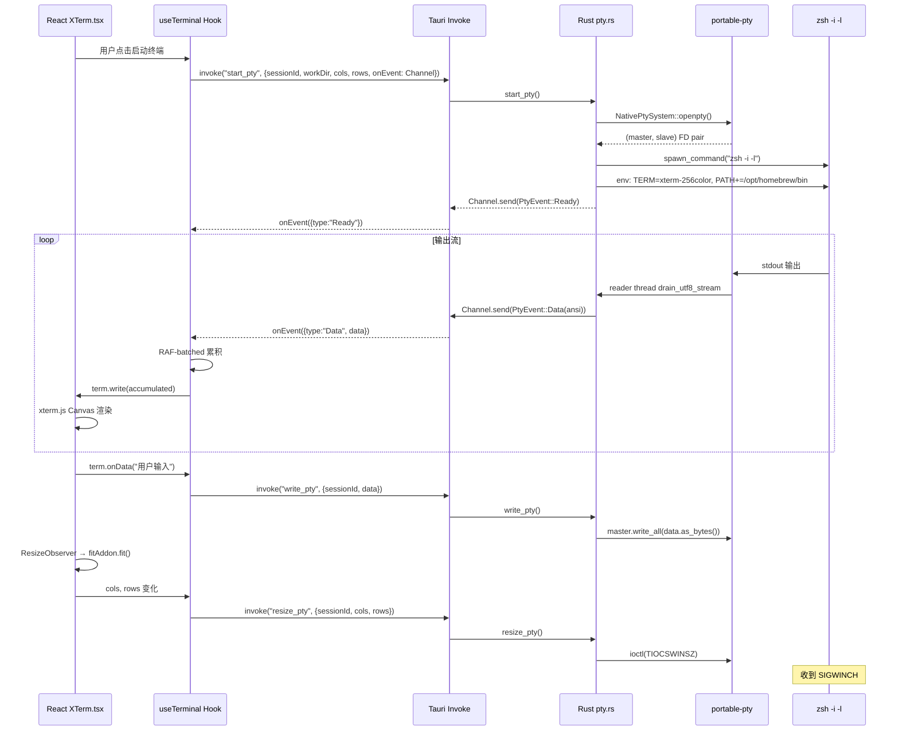

#### C.2 节点清单

| # | 节点 | 位置 | 风险 | 故障模式 |
|---|------|------|------|---------|
| C1 | XTerm.tsx Canvas 渲染器 | `desktop/src/components/XTerm.tsx` | 🟡 中 | CJK + 表格字符渲染异常(已知 WebGL 有问题，已切 Canvas) |
| C2 | useTerminal RAF 批处理 | `desktop/src/hooks/useTerminal/` | 🟡 中 | RAF 帧丢失 → 输出延迟 |
| C3 | Tauri Channel 序列化 | Tauri Runtime | 🟢 低 | 16KB 缓冲，大量输出可能延迟 |
| C4 | Rust start_pty PATH 增强 | `desktop/src-tauri/src/pty.rs` | 🔴 高 | GUI 环境 PATH 不完整 → tool 找不到 |
| C5 | PTY reader 线程 | `desktop/src-tauri/src/pty.rs` | 🟡 中 | UTF-8 跨读取边界截断多字节字符 |
| C6 | Rust write_pty | `desktop/src-tauri/src/pty.rs` | 🟢 低 | lock 作用域已最小化，避免 write 饥饿 |
| C7 | Rust resize_pty | `desktop/src-tauri/src/pty.rs` | 🟢 低 | TIOCSWINSZ ioctl 失败(极罕见) |
| C8 | Rust kill_pty | `desktop/src-tauri/src/pty.rs` | 🟡 中 | master FD 关闭触发 SIGHUP，子进程可能不响应 |

#### C.3 风险详情

| 风险编号 | 描述 | 可能性 | 影响 | 缓解措施 | 状态 |
|---------|------|--------|------|---------|------|
| **C-R1** | **GUI PATH 不完整** — 从 Finder 启动的 Tauri App PATH 仅 `/usr/bin:/bin` | 高 | 找不到 Claude/Codex/Qoder 二进制 | PATH 增强 + `-i -l` login shell | ✅ 已实现 |
| **C-R2** | **字体切换导致状态丢失** — XTerm 组件在字体变化时 remount，不复现 ANSI 文本 | 中 | 🟡 终端显示内容丢失 | 已知设计限制 | ⚠️ 设计如此 |
| **C-R3** | **TERM 变量缺失** — 无 TERM 时 zsh 禁用行编辑器 | 中 | 🟡 终端交互异常 | 显式设置 `TERM=xterm-256color` | ✅ 已实现 |
| **C-R4** | **UTF-8 截断** — 多字节字符跨 PTY read 边界 | 中 | 🟡 终端显示乱码 | `drain_utf8_stream` pending buffer | ✅ 已实现 |
| **C-R5** | **kill_pty 不优雅** — SIGKILL 直接杀，不会触发子进程清理 | 低 | 🟢 孤儿进程 | master FD drop 触发 SIGHUP | 🟢 可接受 |

#### C.4 对其他链路的影响

| 受影响链路 | 影响方式 |
|-----------|---------|
| **链路 H** | 需要 config.yaml 读取 profile 环境变量 |
| **其他链路** | 完全独立，不依赖云端或 Agent |

---

### 链路 D: Agent 会话生命周期

**链路描述**: Agent 守护进程的完整生命周期：launchd 启动 → 崩溃计数 → WSS 连接 → 状态机转换 → 会话管理 → 心跳 → 崩溃恢复。

**参与仓库**: kn (Agent)

#### D.1 状态机

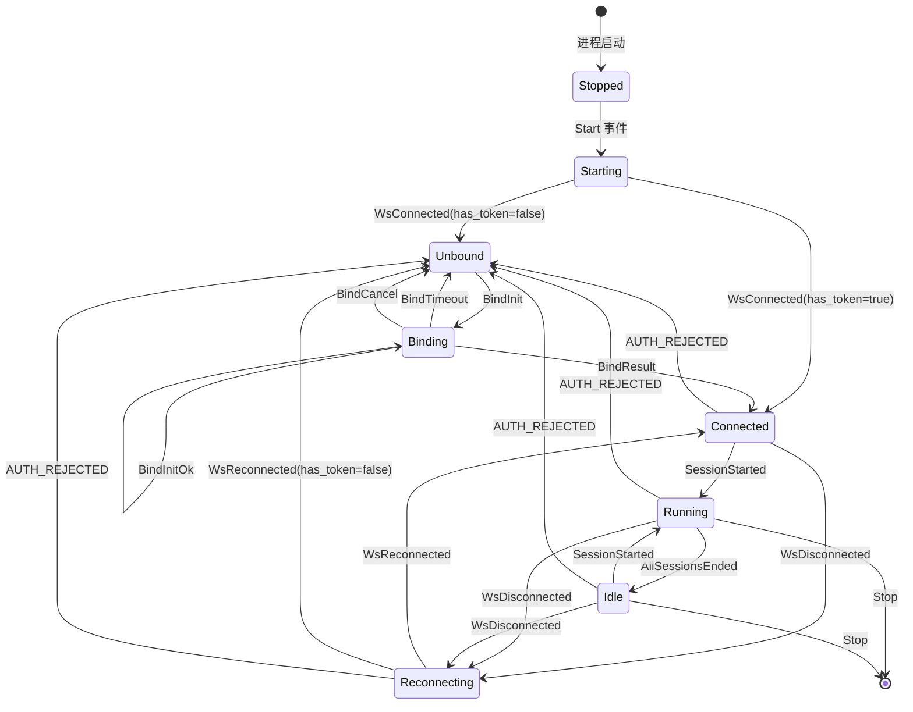

#### D.2 WSS 连接循环

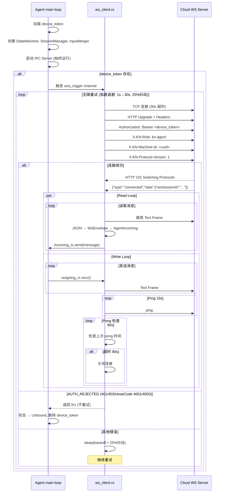

#### D.3 节点清单

| # | 节点 | 位置 | 风险 | 故障模式 |
|---|------|------|------|---------|
| D1 | launchd plist | `~/Library/LaunchAgents/com.kn.agent.plist` | 🟢 低 | plist 损坏 → Agent 不启动 |
| D2 | 崩溃计数器 | `agent/src/state.rs` crash_count | 🟡 中 | 原子写(tmp+rename)，两实例竞争 |
| D3 | Safe Mode 检测 | `agent/src/state.rs` | 🟡 中 | crash_count > 5 → 安全模式，禁止启动会话 |
| D4 | WSS 连接循环 | `agent/src/ws_client.rs` run_ws_loop() | 🔴 高 | 无限重试，指数退避，AUTH_REJECTED 特殊处理 |
| D5 | Read Loop | `agent/src/ws_client.rs` connect_and_run() | 🔴 高 | JSON 解析失败 → 断开连接 |
| D6 | Write Loop | `agent/src/ws_client.rs` connect_and_run() | 🔴 高 | unbounded channel → 发送队列无限增长 |
| D7 | Ping/Pong | `agent/src/ws_client.rs` | 🔴 高 | 15s ping 间隔，90s pong 超时 |
| D8 | 状态广播 | `agent/src/state.rs` broadcast channel | 🟢 低 | 订阅者慢消费 → 旧状态被覆盖 |

#### D.4 风险详情

| 风险编号 | 描述 | 可能性 | 影响 | 缓解措施 | 状态 |
|---------|------|--------|------|---------|------|
| **D-R1** | **崩溃循环 → Safe Mode** — 60s 内崩溃 6 次触发安全模式，无法启动会话 | 低 | 🔴 Agent 完全不可用 | 安全模式本身是保护机制 | ✅ 设计如此 |
| **D-R2** | **AUTH_REJECTED 不重连** — device_token 被吊销后不走重试逻辑 | 中 | 🔴 需用户重新绑定 | 自动转换到 Unbound 状态，等待绑定 | ✅ 已实现 |
| **D-R3** | **重连时 session_created 重复** — Agent 重连后发送旧会话信息，Cloud 需幂等处理 | 中 | 🟡 重复通知 iOS | SessionCoordinator 幂等检查 | ✅ 已实现 |
| **D-R4** | **重连时未检测 token 吊销** — 已连接的 Agent 不会中途校验 token 有效性 | 低 | 🟡 token 被吊销后仍保持连接 | 下次断连重连才会发现 | ⚠️ 设计限制 |
| **D-R5** | **Unbounded channel 内存风险** — write loop 的 outgoing channel 无界 | 低 | 🟡 输出积压时内存增长 | 上游 OutputFanout 已有分块限制 | ⚠️ 部分缓解 |

#### D.5 对其他链路的影响

| 受影响链路 | 影响方式 |
|-----------|---------|
| **链路 A** | Agent 必须运行才能绑定和轮询 |
| **链路 B** | Agent WSS 连接是远程控制的前提 |
| **链路 E** | Shell IPC 依赖 Agent IPC Server 运行 |
| **链路 J** | Agent 崩溃恢复触发会话恢复流程 |

---

### 链路 E: Shell 包装器 → Agent IPC

**链路描述**: 用户在终端中执行 `ai claude myprofile`，Shell 函数尝试通过 Agent IPC 创建会话，失败则回退到直接启动 CLI。

**参与仓库**: kn (Shell + Agent)

#### E.1 时序图

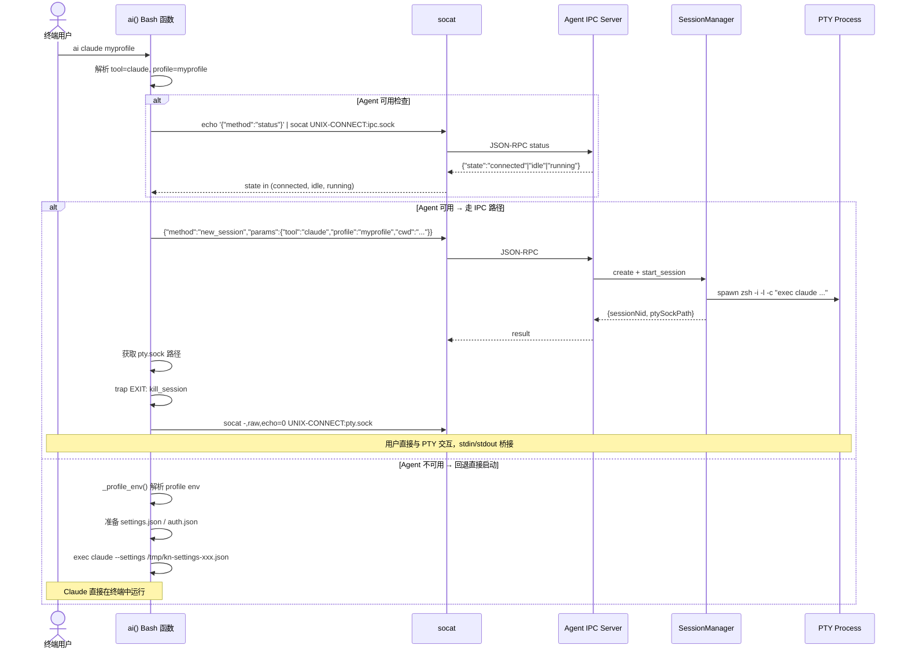

#### E.2 节点清单

| # | 节点 | 位置 | 风险 | 故障模式 |
|---|------|------|------|---------|
| E1 | ai() 入口函数 | `shell/ai-profile.sh` | 🟢 低 | 参数解析错误 |
| E2 | _ai_agent_launch() | `shell/ai-profile.sh` | 🟡 中 | socat 不在 PATH 上 |
| E3 | Agent IPC new_session | `agent/src/ipc.rs` | 🔴 高 | 与链路 D 相同的 PTY spawn 风险 |
| E4 | Agent IPC attach | `agent/src/ipc.rs` | 🟡 中 | pty.sock 创建失败 |
| E5 | socat 终端桥接 | `shell/ai-profile.sh` | 🟡 中 | 桥接断开 → 终端卡在 raw 模式 |
| E6 | EXIT trap | `shell/ai-profile.sh` | 🟡 中 | SIGKILL 不触发 trap → pty.sock 不清理 |
| E7 | _profile_env() 回退 | `shell/ai-profile.sh` | 🟡 中 | sed/awk YAML 解析不完整 |
| E8 | _ai_launch_with_profile() | `shell/ai-profile.sh` | 🟡 中 | 临时 settings.json 泄露 |

#### E.3 风险详情

| 风险编号 | 描述 | 可能性 | 影响 | 缓解措施 | 状态 |
|---------|------|--------|------|---------|------|
| **E-R1** | **socat 依赖** — macOS 默认未安装 socat | 高 | 🟡 IPC 路径失败 → 回退到直接启动 | 有回退机制 | ✅ 已缓解 |
| **E-R2** | **raw 模式恢复** — `socat -,raw,echo=0` 禁用本地回显。桥接断开后终端卡在 raw 模式 | 中 | 🟡 需手动 `reset` 命令恢复 | 无自动恢复 | ❌ 未实现 |
| **E-R3** | **SIGKILL 不触发 EXIT trap** — `kill -9` 跳过 trap，pty.sock 不清理 | 低 | 🟢 残留 socket 文件 | Agent 会话结束时清理 | 🟢 可接受 |
| **E-R4** | **YAML 解析分歧** — sed/awk 回退解析与 Python 解析器可能对边界情况不一致 | 低 | 🟡 profile 环境变量加载错误 | 优先使用 profile CLI | ⚠️ 部分缓解 |

#### E.4 对其他链路的影响

| 受影响链路 | 影响方式 |
|-----------|---------|
| **链路 D** | 依赖 Agent IPC Server(D) 运行 |
| **链路 H** | 依赖 config.yaml(H) 读取 profile |

---

### 链路 F: 用户认证

**链路描述**: iOS 用户注册/登录/Apple 登录获取 JWT Token(15min access + 30d refresh)。Token 生命周期包括 HTTP 401 自动刷新和 WSS 认证失败刷新。

**参与仓库**: kn-cloud (REST API)、kn-ios (客户端)

#### F.1 登录时序图

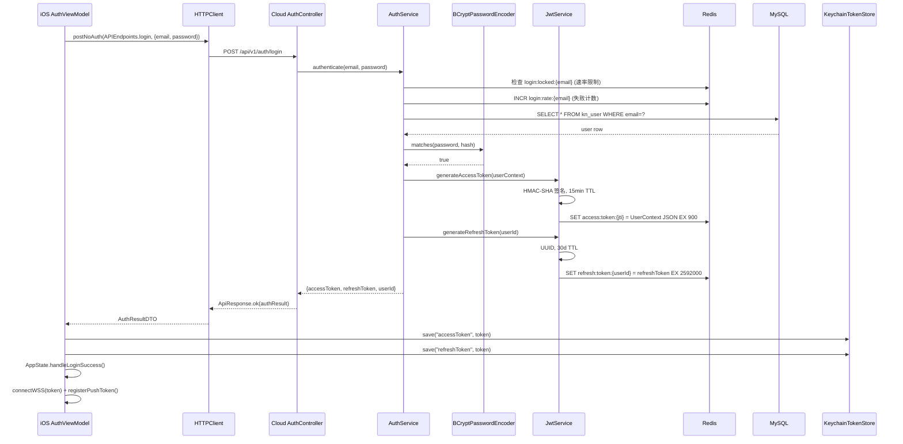

#### F.2 Token 刷新时序图

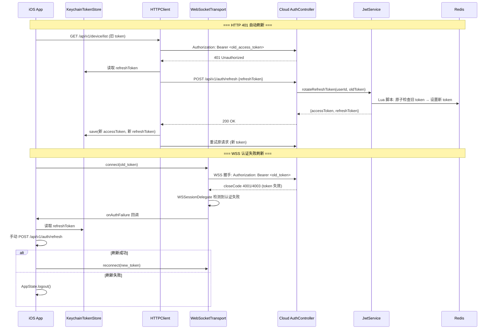

#### F.3 节点清单

| # | 节点 | 位置 | 风险 | 故障模式 |
|---|------|------|------|---------|
| F1 | iOS HTTPClient Bearer 注入 | `kn-ios/.../HTTPClient.swift` | 🔴 高 | token 过期未刷新 |
| F2 | iOS KeychainTokenStore | `kn-ios/.../KeychainTokenStore.swift` | 🔴 高 | 设备重启后首次解锁前不可用 |
| F3 | iOS WSS 认证失败检测 | `kn-ios/.../WebSocketTransport.swift` WSSessionDelegate | 🔴 高 | 误判 → 不必要登出；漏判 → 无效连接 |
| F4 | Cloud LoginRateLimiter | `kn-cloud-api/.../LoginRateLimiter.java` | 🟡 中 | 5 次失败/15min → 账号锁定 |
| F5 | Cloud BCrypt 验证 | Spring Security BCryptPasswordEncoder | 🟢 低 | 常数时间比较，防时序攻击 |
| F6 | Cloud JwtService 签发 | `kn-cloud-common/.../JwtService.java` | 🔴 高 | HMAC-SHA 密钥泄露 → 所有 token 可伪造 |
| F7 | Cloud AuthFilter 校验 | `kn-cloud-api/.../AuthFilter.java` | 🔴 高 | JWT 验证 + Redis 存在性双重检查 |
| F8 | Cloud refresh 原子旋转 | `kn-cloud-common/.../JwtService.java` rotateRefreshToken() | 🔴 高 | Lua 原子 CAS，并发刷新只成功一个 |
| F9 | Cloud Apple 登录验证 | `kn-cloud-api/.../AppleAuthService.java` | 🟡 中 | Apple JWKS 获取失败 → 登录阻断 |

#### F.4 风险详情

| 风险编号 | 描述 | 可能性 | 影响 | 缓解措施 | 状态 |
|---------|------|--------|------|---------|------|
| **F-R1** | **Refresh Token 旋转竞态** — 两个并发 /refresh 请求同时使用同一旧 refresh token。Lua 原子 CAS 保证只有一个成功，另一个得到 null → 强制登出 | 低 | 🔴 用户被意外登出 | 客户端应串行化 refresh 请求 | ⚠️ 部分 |
| **F-R2** | **Redis 不可用时 Refresh** — JWT Redis 检查失败 → 所有 token 被认为无效 | 低 | 🔴 所有用户需重新登录 | 无降级 | ❌ 未实现 |
| **F-R3** | **Keychain 可访问性** — `kSecAttrAccessibleAfterFirstUnlockThisDeviceOnly` → 设备重启后首次解锁前 token 不可用 | 中 | 🟡 App 启动时 token 读取失败 | 设计选择(安全性优先) | ✅ 设计如此 |
| **F-R4** | **JWT 密钥轮换** — 无机制在不失效所有 token 的情况下更换 JWT 签名密钥 | 很低 | 🟡 密钥泄露后无平滑过渡 | 无 | ❌ 未实现 |
| **F-R5** | **WSS 认证失败 closeCode 不准** — closeCode 4001/4003/1008/3001 也可能由其他原因触发 → 误刷新 | 低 | 🟡 不必要的 token 刷新 | 多码检测 + reason string 匹配 | ✅ 已实现 |
| **F-R6** | **账户过期后 Token 仍有效** — 虽然 AuthFilter 检查 `ctx.isExpired()`，但接入时段的 token 在过期后仍可用 | 低 | 🟡 账户状态变更后的时间窗口 | access_token TTL 仅 15min | 🟢 可接受 |

#### F.5 对其他链路的影响

| 受影响链路 | 影响方式 |
|-----------|---------|
| **链路 A** | iOS bind-confirm 需要有效 JWT |
| **链路 B** | iOS WSS 连接需要有效 JWT |
| **链路 I** | iOS 兑换需要有效 JWT |

---

### 链路 G: 跨节点消息中继

**链路描述**: 当 iOS 用户和 Agent 连接到 Cloud WS 的不同节点时，消息通过 Redis Pub/Sub 跨节点传递。

**参与仓库**: kn-cloud (WS)

#### G.1 时序图

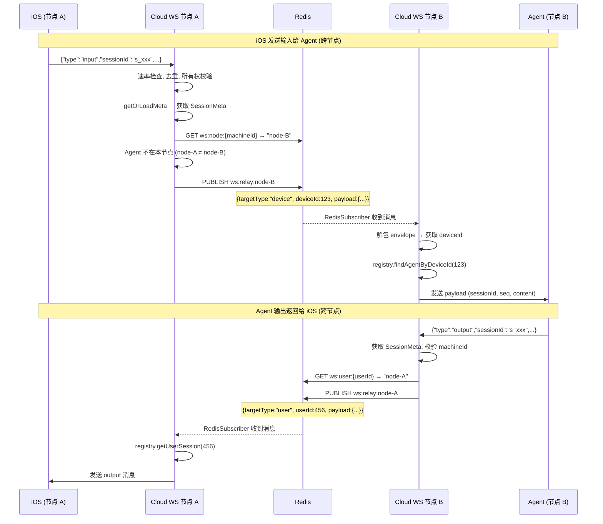

#### G.2 节点清单

| # | 节点 | 位置 | 风险 | 故障模式 |
|---|------|------|------|---------|
| G1 | tryDirectRelay | `MessageRelayService.java` | 🟢 低 | O(1) 本地查表 |
| G2 | tryCrossNodeRelay | `MessageRelayService.java` | 🟡 中 | **Redis Pub/Sub 不可靠投递** |
| G3 | bufferForOfflineAgent | `MessageRelayService.java` | 🟡 中 | Redis List `pending:agent:{machineId}` 最多 1000 条, 7d TTL |
| G4 | RedisSubscriber | `kn-cloud-ws/.../RedisSubscriber.java` | 🔴 高 | 订阅断开 → 跨节点消息全部丢失 |
| G5 | drainPendingMessages | `ConnectionService.java` | 🟡 中 | Agent 重连时投递缓冲消息，顺序可能乱 |
| G6 | ws:node 路由表 | Redis `ws:node:{machineId}` | 🟡 中 | 90s TTL，Agent 崩溃后最多 90s 仍指向死节点 |
| G7 | deviceIdToMachineId 反向索引 | `ConnectionRegistry.java` | 🟢 低 | O(1) deviceId → WebSocketSession |

#### G.3 风险详情

| 风险编号 | 描述 | 可能性 | 影响 | 缓解措施 | 状态 |
|---------|------|--------|------|---------|------|
| **G-R1** | **Pub/Sub 消息丢失** — Redis Pub/Sub 是 fire-and-forget。订阅者重启、网络抖动均导致静默丢消息 | 中 | 🔴 输入/输出/控制信号/会话事件丢失 | 无 ack，无重传 | ❌ 未实现 |
| **G-R2** | **节点 ID 过期** — ws:node TTL 90s，Agent 崩溃后最多 90s 仍指向死节点 | 中 | 🟡 跨节点中继失败、静默丢弃 | 心跳刷新间隔 15s 远小于 TTL | ⚠️ 部分缓解 |
| **G-R3** | **deviceId 为 null** — Desktop IPC 创建的 Session 可能无 deviceId → 跨节点查找只能用 machineId 回退 | 低 | 🟡 查找效率降低 | machineId 作为 envelope 的 fallback 字段 | ✅ 已实现 |
| **G-R4** | **SCAN 性能** — SessionHeartbeatMonitor SCAN `user:sessions:*` 模式扫描，O(N) 于匹配该模式的 key 数 | 中 | 🟡 大量用户时 Redis CPU 突增 | 30s 间隔，count 100 | ⚠️ 需监控 |

#### G.4 对其他链路的影响

| 受影响链路 | 影响方式 |
|-----------|---------|
| **链路 B** | 所有远程控制消息依赖跨节点中继投递 |
| **链路 D** | Agent 的 ws:node 注册和心跳刷新 |
| **链路 J** | 会话事件(session_created/ended)跨节点通知 |

---

### 链路 H: 配置管理

**链路描述**: Profile 配置存储在 `~/.kn/config.yaml`。Desktop Tauri cmd / Python CLI 均读写此文件，通过 fcntl.flock 实现跨进程锁。

**参与仓库**: kn (Desktop + CLI + Shell)

#### H.1 时序图

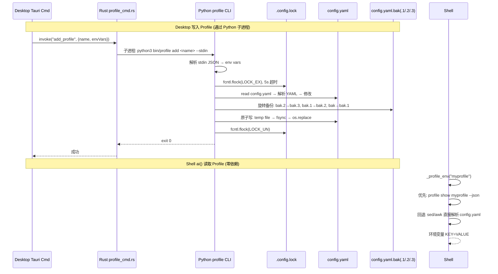

#### H.2 节点清单

| # | 节点 | 位置 | 风险 | 故障模式 |
|---|------|------|------|---------|
| H1 | Desktop profile_cmd.rs | `desktop/src-tauri/src/profile_cmd.rs` | 🟢 低 | 子进程调用 Python CLI |
| H2 | Python 手写 YAML 解析 | `lib/config.py` _parse_yaml() | 🟡 中 | 复杂 YAML 结构解析错误 |
| H3 | Python fcntl.flock | `lib/config.py` write_config() | 🟡 中 | 5s 超时后放弃 → 写入失败无感知 |
| H4 | Python 原子写 | `lib/config.py` temp+fsync+rename | 🟢 低 | macOS 上 os.replace 是原子的 |
| H5 | Python 备份旋转 | `lib/config.py` 3 代备份 | 🟢 低 | 两个进程同时旋转 → 可能丢失一代 |
| H6 | Rust serde_yaml | Tauri commands (直接读写) | 🟡 中 | **Rust 直接写 config.yaml 不走 Python 子进程** → 绕过 fcntl 锁 |
| H7 | Shell sed 回退 | `shell/ai-profile.sh` _profile_env() | 🟡 中 | 只解析简单的 `key: value` 行 |
| H8 | Rust 独占锁 | `desktop/src-tauri/src/lib.rs` with_write_lock_exclusive() | 🔴 高 | mutex 必须在 file lock 之前获取，否则死锁 |

#### H.3 风险详情

| 风险编号 | 描述 | 可能性 | 影响 | 缓解措施 | 状态 |
|---------|------|--------|------|---------|------|
| **H-R1** | **锁顺序死锁** — mutex 必须在 file lock 之前获取。违反顺序 → 与 Python CLI 死锁 | 低 | 🔴 两个进程均卡死 | CLAUDE.md 有明确文档 | ⚠️ 靠纪律 |
| **H-R2** | **Rust 直接写绕过 Python 锁** — 某些 Tauri command 直接用 serde_yaml 写 config.yaml，不经过 Python CLI | 中 | 🟡 并发写冲突 | `with_write_lock_exclusive()` 统一入口 | ✅ 已实现 |
| **H-R2a** | **Shell `_profile_switch()` 绕过配置写锁** — `ai profile switch <name>` fallback 路径使用 `sed -i ''` 直接原地修改 `config.yaml`，**没有获取 `.config.lock`、没有 3 代备份旋转、没有 tmp+fsync+rename 原子写**。与 Desktop/Python CLI 的安全写路径完全不一致。代码位置: `shell/ai-profile.sh:85` | 中 | 🔴 并发写时数据损坏、无备份可恢复 | 无 (Shell 有 `PROFILE_CMD` 时走 CLI，但 fallback 无保护) | ❌ 未实现 |
| **H-R3** | **YAML 解析不一致** — Python 解析器、Rust serde_yaml、Shell sed 对边界情况处理不同 | 低 | 🟡 同一个值被不同组件读到不同结果 | format 统一，值限制为简单字符串 | ⚠️ 部分 |
| **H-R4** | **Key 排序导致 diff 噪音** — _format_yaml 始终排序 key → 每次写入顺序可能变化 | 低 | 🟢 git diff 噪音(如果 config 被 tracked) | 一般不会被 tracked | 🟢 可忽略 |
| **H-R5** | **备份旋转并发冲突** — 两个进程同时旋转备份 | 很低 | 🟢 最多丢失一代备份 | 3 代备份已足够 | 🟢 可接受 |

#### H.4 对其他链路的影响

| 受影响链路 | 影响方式 |
|-----------|---------|
| **链路 C** | Desktop 本地终端需要 profile env vars |
| **链路 E** | Shell 需要读取 profile 配置 |
| **几乎全部** | config.yaml 损坏影响所有本地功能 |

---

### 链路 I: 兑换码流程

**链路描述**: Desktop 或 iOS 用户输入卡密兑换码，Cloud 校验后更新会员有效期。

**参与仓库**: kn (Desktop + Agent)、kn-cloud (REST API)、kn-ios (iOS)

#### I.1 时序图

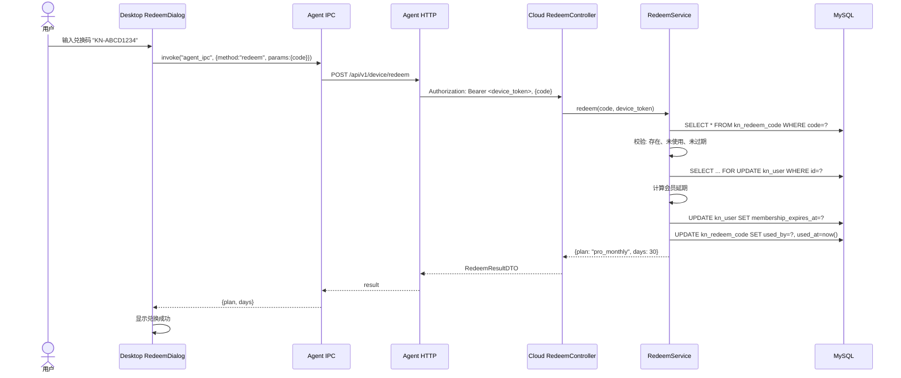

#### I.2 节点清单

| # | 节点 | 位置 | 风险 | 故障模式 |
|---|------|------|------|---------|
| I1 | Desktop RedeemDialog | `desktop/src/components/RedeemDialog.tsx` | 🟢 低 | 输入校验 |
| I2 | Agent IPC redeem 处理 | `agent/src/ipc.rs` | 🟡 中 | Agent 未绑定 → 无 device_token |
| I3 | Agent HTTP redeem | `agent/src/device.rs` redeem() | 🟡 中 | 网络错误 |
| I4 | Cloud RedeemService | `kn-cloud-api/.../RedeemService.java` | 🔴 高 | **双重兑换竞态** — 相同 code 同时被两个请求兑换 |
| I5 | Cloud 会员计算 | `kn-cloud-api/.../RedeemService.java` | 🟡 中 | trial_expires_at 和 membership_expires_at 边界处理 |
| I6 | iOS RedeemView | `kn-ios/.../RedeemView.swift` | 🟢 低 | 走 JWT 认证(非 device_token) |

#### I.3 风险详情

| 风险编号 | 描述 | 可能性 | 影响 | 缓解措施 | 状态 |
|---------|------|--------|------|---------|------|
| **I-R1** | **双重兑换竞态** — 同一 code 两个请求同时到达 → `WHERE used_by IS NULL` 原子 UPDATE 只成功一个 | 低 | 🟡 第二个请求失败(错误信息可能不友好) | DB UNIQUE 约束兜底 | ✅ 已实现 |
| **I-R2** | **会员延期计算** — trial_expires_at 和 membership_expires_at 并存时的叠加逻辑 | 低 | 🟡 用户获得错误的到期时间 | 兑换时统一计算 | ⚠️ 需代码审查 |
| **I-R3** | **Desktop 未绑定无法兑换** — 兑换需要 device_token | 中 | 🟡 用户需先完成绑定 | 提示用户先绑定 | ⚠️ 需改进 UI 提示 |

#### I.4 对其他链路的影响

| 受影响链路 | 影响方式 |
|-----------|---------|
| **链路 A** | Desktop 兑换需要完成绑定(A) |
| **链路 F** | iOS 兑换需要登录(F)获取 JWT |
| **链路 B** | 会员过期后禁止新会话 |

---

### 链路 J: 会话恢复

**链路描述**: Agent 崩溃/重启后恢复会话状态。Cloud 比较已知会话与 Agent 上报状态，终止孤儿会话，恢复活跃会话。

**参与仓库**: kn (Agent)、kn-cloud (WS)

#### J.1 时序图

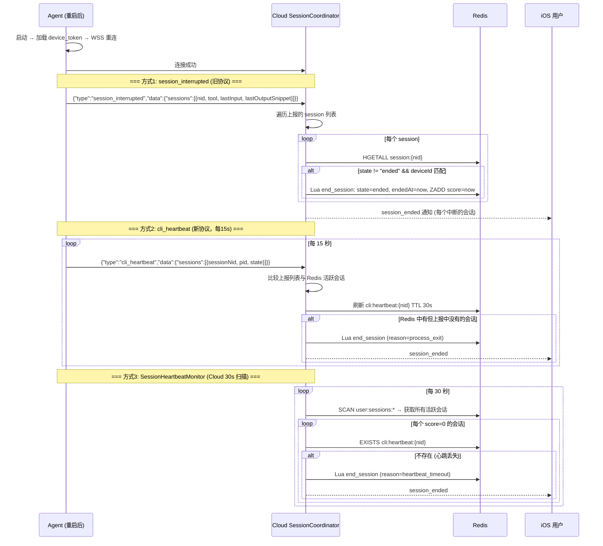

#### J.2 节点清单

| # | 节点 | 位置 | 风险 | 故障模式 |
|---|------|------|------|---------|
| J1 | session_interrupted 处理 | `SessionCoordinator.java` | 🟡 中 | 已废弃协议，旧 Agent 使用 |
| J2 | cli_heartbeat 处理 | `SessionCoordinator.java` handleCliHeartbeat() | 🔴 高 | Agent 驱动的会话存活上报 |
| J3 | SessionHeartbeatMonitor | `kn-cloud-ws/.../SessionHeartbeatMonitor.java` | 🔴 高 | Cloud 驱动的独立存活检查 |
| J4 | end_session.lua | `kn-cloud-ws/src/main/resources/lua/end_session.lua` | 🔴 高 | 原子状态更新(HSET + ZADD + EXPIRE) |
| J5 | Redis cli:heartbeat:{nid} | Redis | 🔴 高 | 30s TTL，Agent 每 15s 刷新 |

#### J.3 风险详情

| 风险编号 | 描述 | 可能性 | 影响 | 缓解措施 | 状态 |
|---------|------|--------|------|---------|------|
| **J-R1** | **检测时间窗口** — Agent 崩溃 → cli_heartbeat 停发 → 15s 后心跳过期 → SessionHeartbeatMonitor 最多 30s 后扫描到 → 最长 45s 才检测到死会话 | 中 | 🟡 iOS 用户看到会话"卡住" | 多层检测缩短窗口 | ⚠️ 可接受 |
| **J-R2** | **误杀慢进程** — CLI 进程 CPU 密集导致心跳循环饥饿 → cli_heartbeat 不发送 → 被标记为 heartbeat_timeout | 低 | 🔴 正常会话被终止 | 无 | ❌ 未实现 |
| **J-R3** | **双层检测覆盖范围不同** — `SessionHeartbeatMonitor` 通过 Redis `SCAN user:sessions:*` 全局扫描 cli:heartbeat key，覆盖所有节点会话。但 `handleCliHeartbeat()` 中的 `scanAndEndMissingSessions()` (Agent 主动上报路径) 只扫本地 `sessionCache`，跨节点会话需等下次全局 SCAN(最多 30s)才能检测 | 低 | 🟡 跨节点孤儿会话清理有延迟(单节点不受影响) | 全局 SCAN 是兜底 | ⚠️ 单节点部署无影响 |
| **J-R4** | **session_interrupted 和 cli_heartbeat 冲突** — 两路径可能同时终止同一会话 | 低 | 🟢 重复 session_ended 通知 | Lua 脚本幂等(检查 state 再更新) | ✅ 已实现 |

#### J.4 对其他链路的影响

| 受影响链路 | 影响方式 |
|-----------|---------|
| **链路 B** | 会话终止 → iOS 收到 session_ended → 更新 UI |
| **链路 D** | Agent 崩溃触发恢复流程 |
| **链路 G** | 跨节点会话事件通知依赖中继 |

---

## 3. 跨切面关注点

### 3.1 认证与授权

#### 3.1.1 凭证类型汇总

| 凭证 | 颁发方式 | TTL | 存储位置 | 撤销方式 |
|------|---------|-----|---------|---------|
| JWT access_token | 登录/刷新 | 15min | iOS Keychain, Redis `access:token:{jti}` | 删除 Redis key |
| JWT refresh_token | 登录/刷新 | 30d | iOS Keychain, Redis `refresh:token:{userId}` | 吊销(Lua 原子替换) |
| device_token | 设备绑定 | 永久 | `~/.kn/agent/device_token` (0600), MySQL kn_device | 解绑更新 DB + 删除文件 |
| Apple identity_token | Apple 签发 | Apple 决定 | 客户端临时持有 | Apple 侧管理 |

#### 3.1.2 认证入口

| 入口 | 认证方式 | 校验点 |
|------|---------|-------|
| REST API (需认证) | Bearer JWT access_token | AuthFilter: JWT 签名 + Redis 存在性 + 账户状态 |
| REST API (公开) | 无 | 配置白名单: `kn.auth.public-paths` |
| WSS Agent | Bearer device_token | DB 查找 device_token + machineId 一致性 |
| WSS iOS | Bearer JWT access_token | JWT 验证 + Redis UserContext |
| Agent IPC | Unix Socket 权限(0600) | 仅本机用户可访问 |

#### 3.1.3 所有权校验点 (IDOR 防护)

每个消息中继路径都独立校验所有权：

| 消息类型 | 校验内容 | 位置 |
|---------|---------|------|
| iOS input → Agent | sender userId == session.userId (Redis Hash) | MessageRelayService.handleInput() |
| iOS ctrl → Agent | 同上 | MessageRelayService.handleCtrl() |
| Agent output → iOS | sender machineId == session.machineId | MessageRelayService.handleOutput() |
| iOS session_list | 仅返回当前用户会话 | SessionCoordinator.handleSessionList() |
| iOS session_messages | session.userId == requester.userId | SessionService.getMessages() |
| iOS device_profiles | device.userId == requester.userId | DeviceService |

### 3.2 锁与并发

| 锁机制 | 范围 | 实现 | 超时 |
|--------|------|------|------|
| fcntl.flock (Python) | 跨进程 config.yaml 写 | 文件锁 `.config.lock` | 5s 自旋等待 |
| fs2 try_lock_exclusive (Rust) | 跨进程 config.yaml 写 | 文件锁 `.config.lock` | 非阻塞 try |
| tokio::sync::Mutex (Rust) | Agent 进程内 | create_mutex, remote_mutex | 无超时 |
| Redis SETNX | 跨节点 session 创建 | `user:session:lock:{userId}` | 10s EXPIRE |
| Redis SETNX | 跨节点消息去重 | `ws:dedup:{sid}:{seq}` | 5min EXPIRE |
| ConcurrentHashMap.compute() | JVM 进程内 | ConnectionRegistry | 原子 CAS |
| DB SELECT ... FOR UPDATE | MySQL 行锁 | bind-confirm, redeem | 事务超时 |
| Lua 脚本 | Redis 原子操作 | refresh token 旋转, end_session | 单线程执行 |

**⚠️ 已知死锁风险**: Rust 侧 `lib.rs` 要求 mutex 必须在 file lock 之前获取。顺序错误会导致与 Python CLI 互锁。

### 3.3 心跳架构 (三层)

```
Layer 1: WSS 连接心跳 (Transport)
  Agent → Cloud: 15s ping
  Cloud → Agent: pong(serverTs)
  HeartbeatMonitor: 30s 扫描 lastPongTimes, 90s 超时 → 断开连接

Layer 2: CLI 进程心跳 (Session)
  Agent → Cloud: cli_heartbeat 每 15s (含 {sessionNid, pid, state})
  Cloud: 刷新 cli:heartbeat:{nid} TTL 30s
  SessionHeartbeatMonitor: 30s 扫描, 死会话 → Lua end_session

Layer 3: iOS WSS 心跳 (Client)
  iOS → Cloud: 30s ping (URLSessionWebSocketTask.sendPing + app ping)
  Cloud: 刷新 ws:user:{userId} TTL 7d
  HeartbeatMonitor: 30s 扫描, 90s 超时 → 断开
```

### 3.4 速率限制

| 限制项 | 限制值 | 窗口 | 范围 | 超限响应 |
|--------|--------|------|------|---------|
| WSS input 消息 | 20 msg/s | 1s 滑动窗口 | 每连接 | ack {dropped:true} |
| WSS ctrl 消息 | 5 msg/s | 1s 滑动窗口 | 每连接 | ack {dropped:true} |
| WSS start_session | 10 req/min | 60s 滑动窗口 | 每连接 | error_notify |
| HTTP login | 5 次/15min | 固定窗口 | 每 email | 账号锁定 15min |
| Agent 最大错误 | 5 个/连接 | 累计 | 每连接 | close(1009) |
| iOS ack dropped 重试 | 1 次 (500ms 后) | — | 每 input | rateLimited → 重试 |
| iOS ack timeout | 不重试 | 30s | 每 input | 直接抛出 requestTimeout |

### 3.5 消息去重

- **实现**: Redis SETNX `ws:dedup:{sessionNid}:{seq}` 5min TTL
- **策略**: Fail-open — Redis 不可用时允许所有消息通过(不阻塞正常通信)
- **Seq 生成**: iOS 每个 TerminableSession 独立单调递增
- **影响**: 5min 窗口内相同 (sessionNid, seq) 被去重；窗口后允许重新处理

### 3.6 离线消息缓冲

- **存储**: Redis List `pending:agent:{machineId}`
- **容量**: 最多 1000 条
- **TTL**: 7 天 (LPUSH 时 SETEX)
- **投递**: Agent 连接建立后 `drainPendingMessages()` 逐条投递
- **溢出**: 超过 1000 条时 LTRIM 保留最新 1000 条

### 3.7 错误传播路径

```
Agent Error (AgentError enum)
  ├── WSS → Cloud: error_notify 消息 → Cloud WS 日志
  ├── WSS → Cloud: close frame (1009 = too many errors)
  ├── IPC → Desktop: error 字段
  └── 日志: ~/.kn/agent/logs/agent.YYYY-MM-DD

Cloud Error (ErrorCode enum)
  ├── REST → HTTP 响应: ApiResponse {code, message}
  ├── WSS → Client: error_notify 消息
  └── WSS → Client: close frame (4001/4003 认证失败, 1009 错误过多)

iOS Error (DomainError enum)
  ├── 网络错误 → userFacingMessage (中文)
  ├── WSS 认证失败 → onAuthFailure → refresh 或 logout
  └── 通用错误 → KnToast / ErrorBanner
```

### 3.8 可观测性缺口

| 缺失项 | 影响 | 建议 |
|--------|------|------|
| **分布式追踪** — 无统一 correlation ID | 无法追踪一条消息在 Agent→Cloud→iOS 的完整路径 | 在 WsEnvelope 增加 `traceId` 字段 |
| **Agent 日志仅写文件** | 无法远程查看 Agent 运行状态 | 支持 WSS 推送日志到 Cloud |
| **Cloud WS 无结构化日志** | 难以按 sessionNid 过滤所有相关日志 | 使用 MDC/SLF4J structured arguments |
| **iOS 使用 print()** | 无持久化日志 | 迁移到 OSLog |
| **无指标导出** | 无法监控连接数、消息速率、心跳健康 | 接入 Prometheus/Datadog |

---

## 4. 风险分类汇总

### 4.1 网络风险

| # | 风险 | 链路 | 严重度 | 缓解状态 |
|---|------|------|--------|---------|
| N1 | WSS 连接断开 (Agent↔Cloud / iOS↔Cloud) | B, D, G | 🔴 严重 | 指数退避重连 |
| N2 | Redis 不可用 — 去重 fail-open，跨节点中继断开 | B, G, J | 🔴 严重 | 无降级 |
| N3 | MySQL 不可用 — 设备/用户查询失败 | A, F, I | 🔴 严重 | Tomcat 连接池 |
| N4 | DNS 解析失败 — Agent 启动无法连接 Cloud | D | 🔴 严重 | 30s 连接超时 + 指数退避 |
| N5 | Redis Pub/Sub 消息丢失 — 跨节点中继不可靠 | B, G | 🔴 严重 | 无 ack/重传 |
| N6 | 网络分区 — Agent WSS 断开但 PTY 进程仍在运行 | B, D, J | 🟡 中等 | 心跳检测 + 会话自动结束 |

### 4.2 状态损坏风险

| # | 风险 | 链路 | 严重度 | 缓解状态 |
|---|------|------|--------|---------|
| S1 | 过期 ws:node 映射 (90s TTL) | G | 🟡 中等 | 心跳刷新 |
| S2 | sessionCache 与 Redis 不一致 | B, J | 🟢 低 | Redis 作为 source of truth |
| S3 | Config 文件损坏 | H | 🟡 中等 | 3 代备份 + 原子写 |
| S4 | 绑定状态从 stale 轮询损坏 | A | 🟡 中等 | generation guard |
| S5 | Agent 崩溃后 Redis 中残留会话元数据 | J | 🟡 中等 | 心跳超时 + Lua 清理 |

### 4.3 并发风险

| # | 风险 | 链路 | 严重度 | 缓解状态 |
|---|------|------|--------|---------|
| C1 | 并发 session 创建 | B | 🟡 中等 | Redis SETNX 互斥锁 |
| C2 | Desktop + iOS 同时输入，顺序无保证 | B | 🟢 低 | 无排序 |
| C3 | 重连时 session_created 重复 | D | 🟡 中等 | SessionCoordinator 幂等检查 |
| C4 | Token 刷新竞态 | F | 🔴 严重 | Lua 原子旋转 |
| C5 | 双重兑换 | I | 🟡 中等 | DB 原子更新 |
| C6 | mutex/file lock 死锁 | H | 🔴 严重 | 文档规定顺序 |

### 4.4 资源耗尽风险

| # | 风险 | 链路 | 严重度 | 缓解状态 |
|---|------|------|--------|---------|
| R1 | **PTY 输出无背压** — unbounded channel 内存膨胀 | B | 🔴 严重 | 无 |
| R2 | Agent 会话数限制(10) | B, D | 🟡 中等 | 明确拒绝 + 错误消息 |
| R3 | Cloud 连接容量(5000 agent + 5000 user) | D, G | 🟡 中等 | ConcurrentHashMap 上限 |
| R4 | Redis 内存 — session 数据, 去重 key, 离线队列 | B, G, J | 🟡 中等 | TTL 自动过期 |

### 4.5 安全风险

| # | 风险 | 链路 | 严重度 | 缓解状态 |
|---|------|------|--------|---------|
| X1 | IDOR — 所有权校验遗漏 (input/ctrl/output/resize 已实现) | B | 🔴 严重 | 每路径独立校验 |
| X1a | **replay_output IDOR** — 无 userId 校验，可越权读取他人会话输出 | B | 🔴 严重 | 无 |
| X2 | device_token 泄露 (Agent 日志) | D | 🔴 严重 | 0600 权限 |
| X3 | Unix Socket 权限 — IPC(0600), PTY proxy(0600) | E, B | 🟡 中等 | 权限控制 |
| X4 | 跨节点中继无消息认证 | G | 🟡 中等 | 内网部署假设 |
| X5 | JWT 密钥轮换无方案 | F | 🟢 低 | 无 |
| X6 | Keychain 首次解锁前不可用 | F | 🟢 低 | 设计选择 |

### 4.6 风险热力图

```
        可能性
        高    中    低    很低
影响
严重    N1    N2    N5    —
        B-R1  N3    X1
        R1    N4    C4
              C6

高      —     A-R6  D-R2  D-R1
              B-R2  S1    F-R2
              G-R2  R2

中等    C-R1  A-R1  D-R5  B-R4
        E-R1  A-R3  H-R2  B-R7
              B-R3  J-R1  G-R4
              G-R1

低      —     C-R2  C-R5  —
              E-R2  H-R3
              F-R3
```

---

## 5. 改进建议

### 5.1 🔴 紧急 (P0) — 单节点部署

| 编号 | 问题 | 建议方案 | 涉及仓库 |
|------|------|---------|---------|
| **P0-1** | **replay_output IDOR 漏洞** | `MessageRelayService.handleReplayOutput()` 增加 userId 所有权校验：从 WSS session attributes 获取请求用户 userId，比对 `meta.userId()`。代码位置: `KnWsHandler.java:651-658`, `MessageRelayService.java:133-150` | kn-cloud |
| **P0-2** | **PTY 输出无背压** | OutputFanout 的 WSS sender 改用 bounded channel(如 256KB)，超出后对远程输出降采样(丢弃非关键帧)或断开远程连接，同时保留本地 ring log 供 replay。注意不能直接阻塞 PTY read(会反向卡住子进程) | kn Agent |
| **P0-3** | **Shell `_profile_switch()` 绕过配置写锁** | fallback 路径不应直接 `sed -i`。优先调用 `PROFILE_CMD` 走 CLI 安全写；无 CLI 时提示用户安装/修复，或实现带 `.config.lock` + 备份 + 原子写的 shell 写路径。代码位置: `shell/ai-profile.sh:85` | kn Shell |

### 5.2 🟡 重要 (P1)

| 编号 | 问题 | 建议方案 | 涉及仓库 |
|------|------|---------|---------|
| **P1-1** | **慢进程误杀** | cli_heartbeat 在独立 tokio 任务中发送，不依赖 PTY read loop 的执行频率 | kn Agent |
| **P1-2** | **输入去重 Redis 单点依赖** | 增加本地 LRU 缓存(如最近 1000 个 seq)作为 Redis 不可用时的去重兜底 | kn-cloud |
| **P1-3** | **iOS ack timeout 不重试** | ack timeout(30s)后应自动重试一次(与服务端 rateLimited 重试一致)，提升弱网体验 | kn-ios |
| **P1-4** | **ANSI 序列边界保护** | OutputFanout 分块时检测 ANSI escape 序列边界(`\x1b[...m` 等)，不在序列中间切断。或至少保证 UTF-8 字符边界(当前 `from_utf8_lossy` 已处理) | kn Agent |
| **P1-5** | **Redis Pub/Sub 消息丢失 (仅多节点时影响)** | 单节点部署 `tryDirectRelay` 是主路径不受影响。未来多节点时改用 Redis Streams 或应用层 ack+重传 | kn-cloud |

### 5.3 🟢 建议 (P2)

| 编号 | 问题 | 建议方案 | 涉及仓库 |
|------|------|---------|---------|
| **P2-1** | **结构化日志** | Cloud WS 使用 SLF4J MDC 带 sessionNid/userId；Agent 使用 tracing span；iOS 迁移 OSLog | 全部 |
| **P2-2** | **指标导出** | 连接数、消息速率、心跳健康、会话数 → Prometheus + Grafana | kn-cloud |
| **P2-3** | **JWT 密钥轮换** | 支持多个有效密钥(key id)，新 token 用新 key 签发，旧 key 在 TTL 后废弃 | kn-cloud |
| **P2-4** | **socat 依赖** | Agent 已有 IPC attach 机制(pty.sock 桥接)，可内置 socat 替代方案或减少依赖 | kn Agent + Shell |
| **P2-5** | **raw 模式恢复** | Shell `ai()` 在 EXIT trap 中执行 `stty sane` 恢复终端设置 | kn Shell |
| **P2-6** | **traceId 分布式追踪** | 在 WsEnvelope 增加 `traceId` 字段，Agent→Cloud→iOS 全链路传递。单节点可先用 sessionNid + userId 关联日志 | kn + kn-cloud + kn-ios |
| **P2-7** | **WSS 消息压缩** | WebSocket Per-Message Deflate 扩展 — ANSI 文本压缩率很好 | kn-cloud + kn Agent |
| **P2-8** | **检测时间窗口优化** | 当前最长 45s(15s 心跳 + 30s 扫描)。可把 scan 间隔改为配置项按需调整，不建议盲目缩短 | kn + kn-cloud |

### 5.4 🔮 未来 (P3)

| 编号 | 建议 | 说明 |
|------|------|------|
| **P3-1** | Redis Cluster / Sentinel | 消除 Redis 单点故障 |
| **P3-2** | MySQL 读写分离 | 设备/用户查询走只读副本 |
| **P3-3** | gRPC 取代 Redis Pub/Sub | 跨节点中继保证投递 + 双向流 |
| **P3-4** | Agent PTY 会话迁移 | 会话可在 Agent 重启后 attach 到已有 PTY |
| **P3-5** | 输出持久化到云端 | PTY 输出不缓冲更好 — 但可选持久化到 S3/OSS 供审计 |

### 5.5 建议修复顺序 (单节点部署)

```
第1轮 (阻断性):
  P0-1 replay_output IDOR    → 安全漏洞，必须最先修
  P0-3 Shell sed -i 绕过锁    → 数据安全，修复简单
  P0-2 Agent 输出背压         → 稳定性，需要仔细设计

第2轮 (重要):
  P1-1 慢进程心跳保护         → 防误杀正常会话
  P1-4 ANSI 边界保护          → 终端渲染正确性
  P1-2 去重本地 LRU 兜底      → Redis 不可用时保持去重
  P1-3 iOS ack timeout 重试   → 弱网体验

第3轮 (改善):
  P2-1 结构化日志 → P2-2 指标 → P2-4 socat → P2-5 stty sane → P2-6 traceId

第4轮 (多节点时升级):
  P1-5 Redis Pub/Sub → gRPC/Streams
  P3-1 Redis HA → P3-3 gRPC relay
```

---

## 6. 附录

### 6.1 Redis Key 完整参考

| Key Pattern | 用途 | TTL | 类型 |
|-------------|------|-----|------|
| `access:token:{jti}` | JWT access token UserContext | 15min | String |
| `refresh:token:{userId}` | Refresh token | 30d | String |
| `ws:user:{userId}` | iOS 用户所在 WSS 节点 | 7d | String |
| `ws:node:{machineId}` | Agent 所在 WSS 节点 | 90s | String |
| `device:online:{machineId}` | Agent 在线标记 | 90s | String |
| `device:conn:{deviceId}` | 设备连接信息(IP等) | 90s | String |
| `device:anomaly:{deviceId}` | IP 异常审计 | 7d | List |
| `bind:code:{code}` | 绑定码 → machineId | 300s | String |
| `bind:result:{code}` | 绑定结果(deviceToken) | 300s | String |
| `session:{nid}` | 会话完整元数据 | 无(结束时 EXPIRE) | Hash |
| `cli:heartbeat:{nid}` | CLI 进程心跳 | 30s | String |
| `user:sessions:{userId}` | 用户会话列表 | 无 | ZSet |
| `user:session:lock:{userId}` | 会话创建互斥锁 | 10s | String(SETNX) |
| `session:messages:{nid}` | 会话消息历史 | 7d | List(cap 100) |
| `ws:dedup:{nid}:{seq}` | 消息去重 | 5min | String(SETNX) |
| `pending:agent:{machineId}` | Agent 离线消息队列 | 7d | List(cap 1000) |
| `push:token:{userId}` | APNs 推送 token | 30d | Set |
| `captcha:{captchaId}` | 验证码答案 | 60s | String |
| `reg:code:{email}` | 注册验证码 | 300s | String |
| `login:rate:{email}` | 登录失败计数 | 15min | String(counter) |
| `login:locked:{email}` | 登录锁定标记 | 15min | String |

### 6.2 WSS 消息类型参考

**Agent → Cloud (由 `X-KN-Role: kn-agent` 限制)**

| type | 频率 | 数据 |
|------|------|------|
| `ping` | 15s | `{}` |
| `session_created` | 按需 | `{sessionId, tool, cwd, cols, rows, source}` |
| `session_ended` | 按需 | `{sessionId, reason}` |
| `output` | 高频(100ms 批处理) | `{sessionId, content(ANSI)}` |
| `cli_heartbeat` | 15s | `[{sessionNid, pid, state}]` |
| `profile_list` | 按需 | `[{name, tool, description}]` |
| `project_list` | 按需 | `[{name, path, defaultProfile}]` |
| `error_notify` | 按需 | `{code, message}` |

**iOS → Cloud (由 `X-KN-Role: kn-mobile` 限制)**

| type | 频率 | 数据 |
|------|------|------|
| `ping` | 30s | `{}` |
| `start_session` | 按需 | `{machineId, deviceName, projectName, tool, profile, cwd, cols, rows}` |
| `input` | 按需(≤20/s) | `{sessionId, seq, content}` |
| `ctrl` | 按需(≤5/s) | `{sessionId, seq, signal(ctrl_c/d/z)}` |
| `resize` | 按需 | `{sessionId, seq, cols, rows}` |
| `session_list` | 重连时 | `{}` |
| `replay_output` | 会话恢复时 | `{sessionNid}` |

### 6.3 数据库表参考

| 表名 | 核心字段 | 关键约束 |
|------|---------|---------|
| `kn_user` | id, email, password(bcrypt), membership, trial_expires_at, membership_expires_at, status, apple_sub | email UNIQUE, apple_sub UNIQUE |
| `kn_device` | id, user_id, device_name, hostname, machine_id, device_token, status, last_seen | machine_id UNIQUE, device_token UNIQUE |
| `kn_session` | id, session_nid, user_id, device_id, tool, profile, cwd, source, started_at, ended_at | session_nid UNIQUE |
| `kn_message` | id, session_id, seq, direction, msg_type, src, content | 已废弃(迁移至 Redis) |
| `kn_redeem_code` | id, code, plan, duration_days, used_by, used_at | code UNIQUE |
| `kn_device_profile` | id, device_id, name, tool, description | (device_id, name) UNIQUE |
| `kn_push_token` | id, user_id, device_token, is_active | device_token UNIQUE |

### 6.4 端口与 Socket 参考

| 端口/Socket | 位置 | 用途 | 权限 |
|-------------|------|------|------|
| 8080 | 服务器 | Cloud REST API | 公网 |
| 8081 | 服务器 | Cloud WebSocket | 公网 |
| `~/.kn/agent/ipc.sock` | macOS | Agent IPC Server (JSON-RPC) | 0600 |
| `~/.kn/agent/sessions/{nid}/pty.sock` | macOS | PTY 代理 (socat 桥接) | 0600 |
| wss://api.knshark.com/v1/ws | 服务器 | WSS 端点 | HTTPS |

### 6.5 配置文件位置

| 文件 | 位置 | 格式 | 管理方式 |
|------|------|------|---------|
| Profile 配置 | `~/.kn/config.yaml` | YAML | fcntl.flock + atomic write |
| Agent 运行时配置 | `~/.kn/agent/config.json` | JSON | 手动/Desktop 配置 |
| Device Token | `~/.kn/agent/device_token` | 纯文本 | 原子 write(0600) |
| 加密密钥 | `~/.kn/agent/.encryption_key` | 二进制 | 0600 |
| 崩溃计数 | `~/.kn/agent/crash_count` | 数字 | tmp+rename 原子写 |
| Shell 包装器 | `~/.kn/shell-rc` | Bash | Desktop install.sh 写入 |
| launchd plist | `~/Library/LaunchAgents/com.kn.agent.plist` | XML | launchctl bootstrap |
| iOS Token | iOS Keychain | — | kSecClassGenericPassword |
| iOS 用户偏好 | iOS UserDefaults | — | UserDefaultsStore |

---

> 本文档由架构审查自动生成，覆盖 3 个仓库、10 条通信链路、25+ 风险点。
> 审查依据: kn (commit `2bc20037`), kn-cloud (main), kn-ios (main)
